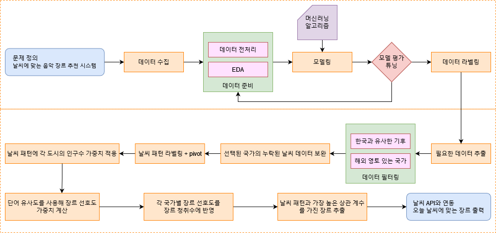

# ⛅ 날씨에 맞는 음악 추천 시스템
> 음악 선택 기준은 개인마다 다르지만 일반적으로 기분 상태와 연관되어 있다고 볼 수 있습니다. 날씨가 사람의 기분 변화에 영향을 줄 수 있다는 점을 고려하여, 오늘의 날씨에 맞는 장르를 추천하는 시스템을 구현했습니다.
<br /><br />

##  👤 팀원
- 김지애, 유가형, 한용수
<br /><br />

## 📅 개발기간
- 전체 개발 기간 : 2024.02.26 ~ 2024.04.01
- 주제 기획 :  2024.2.26 ~ 2024.03.14
- 기능 구현 : 2024.03.15 ~ 2024.03.31
- 최종 발표 : 2024.04.01
<br /><br />

## 📜 스킬
> **사용 언어**
> 
><span style="display: inline-flex; align-items: center;"></span>

> **라이브러리**
> 
><span style="display: inline-flex; align-items: center;">
&nbsp;

&nbsp;

&nbsp;

&nbsp;

&nbsp;

&nbsp;

&nbsp;

&nbsp;

</span>
<br /><br />

## 📘 각 모델에서 사용된 데이터 설명
> #### 장르 분류 모델
- 음악 특성 데이터 : 3만 곡의 장르, 음악 특성
- 캐글 날씨 데이터 : 수집된 날, 수집된 유럽 국가, 음악 특성, 청취수 

> #### 장르 추천
- 장르 분류 모델로 얻은 국가별 장르 청취수
- 위치 기반 날씨 데이터
- 행정 구역, 도시 등 지리 데이터
- 각 국가의 상위 100개 음악 태그
<br /><br />

## 📓 워크 플로우

<br /><br />

## 📁 프로젝트 구조
```angular2html 
|   .gitignore
|   config.json
|   step1_genre_classifier.ipynb
|   step2_kaggle_weather_eda_and_recollect.ipynb
|   step3_today_recommend.ipynb
|   root.py
|
+---weather
|   +---model
|   |       recommend.csv
|   |       scale.joblib
|   |       time_model.joblib
|   |
|   +---module
|   |   |   data_preprocess.py
|   |   |   eda.py
|   |
\---data
    |   thirty_thousand_spotify_songs.csv
    |   weather_spotify_songs.csv
    |   kaggle_weather_with_genre.csv
    |   
    +---cleaned
    |       CITY.csv
    |       COUNTRY.csv
    |       ERD.drawio.png
    |       GENRE_STREAMS_BY_COUNTRY.csv
    |       LAST_FM.csv
    |       STATE.csv
    |       WEATHER.csv
    |       
    +---h5py
    |   +---air_pressure
    |   |       PSurf1.h5 ~ PSurf12.h5
    |   |       
    |   +---rainf
    |   |       Rainf1.h5 ~ Rainf12.h5
    |   |       
    |   +---snowf
    |   |       Snowf1.h5 ~ Snowf12.h5
    |   |       
    |   +---specific_humidity
    |   |       Qair1.h5 ~ Qair12.h5
    |   |       
    |   +---temperature
    |   |       Tair1.h5 ~ Tair12.h5
    |   |       
    |   \---wind
    |           Wind1.h5 ~ Wind12.h5
    |           
    \---original
        +---geo_natural_earth
        |   +---city
        |   |       city.cpg
        |   |       city.dbf
        |   |       city.html
        |   |       city.prj
        |   |       city.shp
        |   |       city.shx
        |   |       city.txt
        |   |       
        |   +---country
        |   |       country.cpg
        |   |       country.dbf
        |   |       country.prj
        |   |       country.shp
        |   |       country.shx
        |   |       country.txt
        |   |       
        |   \---state
        |           state.cpg
        |           state.dbf
        |           state.html
        |           state.prj
        |           state.shp
        |           state.shx
        |           state.txt
        |           
        +---weather_csv
        |       IGRA_2019_01.csv ~ IGRA_2019_12.csv
        |       
        \---weather_nc
            +---air_pressure
            |       PSurf_WFDE5_CRU_201901_v2.1.nc ~ PSurf_WFDE5_CRU_201912_v2.1.nc
            |       
            +---rainfall
            |       Rainf_WFDE5_CRU+GPCC_201901_v2.1.nc ~ Rainf_WFDE5_CRU+GPCC_201912_v2.1.nc
            |       
            +---snowfall
            |       Snowf_WFDE5_CRU+GPCC_201901_v2.1.nc ~ Snowf_WFDE5_CRU+GPCC_201912_v2.1.nc
            |       
            +---specific_humidity
            |       Qair_WFDE5_CRU_201901_v2.1.nc ~ Qair_WFDE5_CRU_201912_v2.1.nc
            |       
            +---temperature
            |       Tair_WFDE5_CRU_201901_v2.1.nc ~ Tair_WFDE5_CRU_201912_v2.1.nc
            |       
            \---wind
                    Wind_WFDE5_CRU_201901_v2.1.nc ~ Wind_WFDE5_CRU_201912_v2.1.nc
```
<br /><br />

## 📑 Install
```shell
conda install jupyter --yes
conda install folium --yes
conda install xgboost --yes
conda install numpy --yes
conda install seaborn --yes
conda install matplotlib --yes
conda install bokeh --yes
conda install pandas --yes
conda install geopandas --yes
conda install shapely --yes
conda install scikit-learn --yes
conda install requests --yes
conda install xarray --yes
conda install h5py --yes
conda install lightgbm --yes
conda install tslearn --yes
conda install gensim --yes
conda install -c conda-forge tslearn --yes
conda install netCDF4 --yes
```
<br /><br />

## 📝 데이터 출처

- [장르 분류를 위한 음악 특성 데이터](https://www.kaggle.com/datasets/joebeachcapital/30000-spotify-songs)
- [1년 간 수집된 음악 청취수 및 음악 특성 데이터](https://www.kaggle.com/datasets/lautytonks/top-200-spotify-european-song-and-weather-data)
- [위치 기반 날씨 데이터](https://cds.climate.copernicus.eu/cdsapp#!/dataset/derived-near-surface-meteorological-variables?tab=overview)
- [행정 구역, 도시 등 지리 데이터](https://www.naturalearthdata.com/)
- [국가별 음악 선호도를 위한 Last.Fm API](https://www.last.fm/api)
